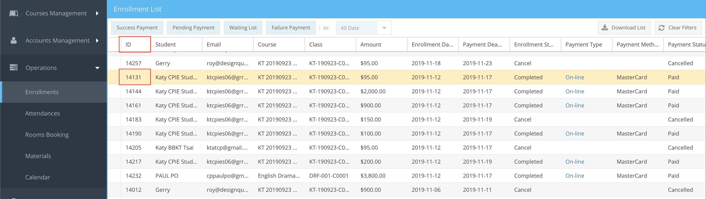
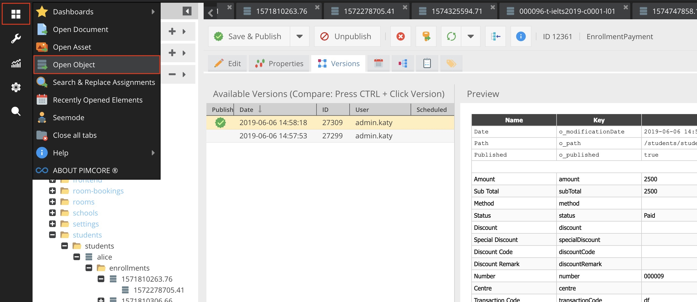
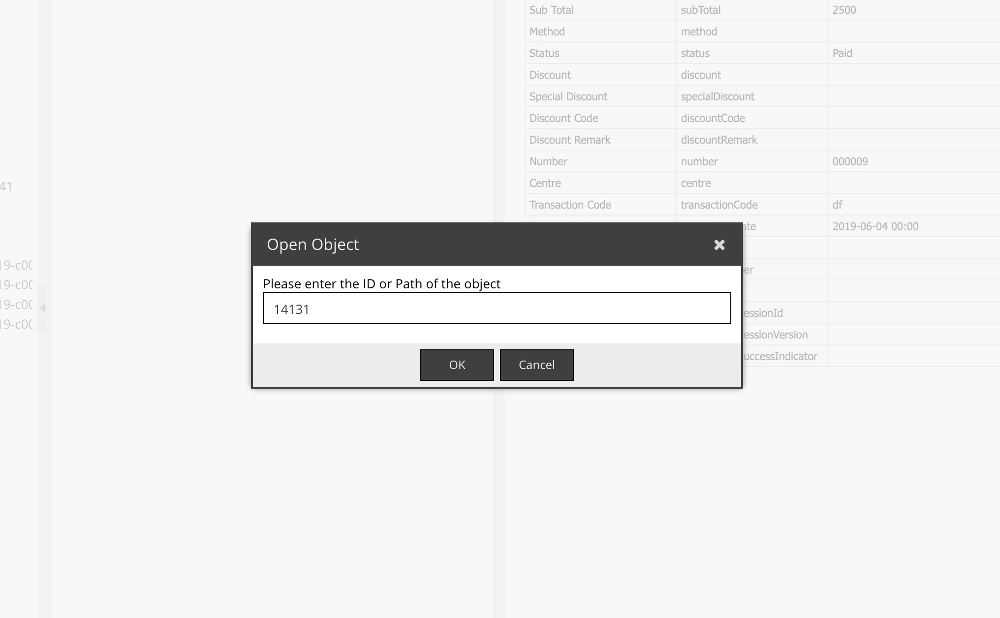
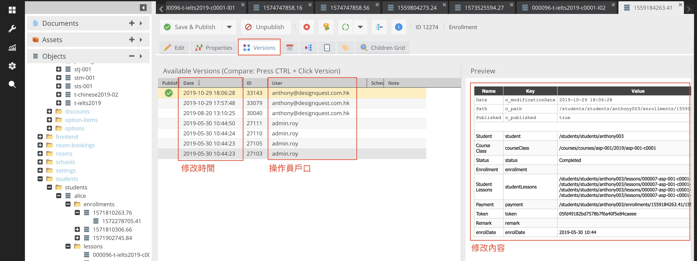

# 基礎知識

* [表頭](#表頭-table-header)
    * [更改欄位 (Columns)](#更改欄位-columns)
    * [排序 (Sorting)](#排序-sorting)
    * [篩選器 (Filters)](#篩選器-filters)
* [工具列](#工具列)
    * [操作鍵/快捷鍵](#操作鍵快捷鍵)
    * [上載列表(Upload CSV)](#上載列表-upload-csv)
    * [下載列表(Download List)](#下載列表-download-list)
    * [清除篩選器(Clear Filters)](#清除篩選器-clear-filters)
* [右鍵功能選單](#右鍵功能選單)
* [頁數控制](#頁數控制)
* [修改記錄](#修改記錄)

本系統以試算表的形式顯示記錄，其操作方法與Excel的試算表十分相似。

## 表頭 (Table header)
列表的表頭隱藏了以下功能，以方便操作員更容易找到所須資料。

#### 更改欄位 (Columns)
可以自訂欄位，顯示最佳工作列表。  

部份欄位是預設隱藏。

#### 排序 (Sorting)
可以直接按下表頭欄位，允許操作員按順序或例序方式排列，

或表頭旁邊的下箭咀。

所有排序只允許按一個表頭欄位排列，不支持多個表頭欄位排列。

#### 篩選器 (Filters)
可以輸入關鍵字篩選項目。

不同欄位會有不同類別篩選模式。

  
（數字篩選模式）

  
（分類篩選模式）

> 有關如何清除篩選操作，[按此了解](#清除篩選器-clear-filters) 

---

## 工具列
#### 操作鍵/快捷鍵
會隨著不同的頁面而變化，提供不同的功能。  
相關功能。請參閱該頁面簡介。

#### 上載列表 (Upload CSV)
先準備CSV檔案，你可以在&nbsp;&nbsp;&nbsp;&nbsp;取得它，並修改內容。
> 有關如何下載列表，[按此了解](#下載列表-download-list)  

按下&nbsp;&nbsp; &nbsp;&nbsp;→ &nbsp;&nbsp;&nbsp;&nbsp;把已預備好的CSV檔案上傳。

 

如果發現 **Status** 有紅字「Fail」，請按下&nbsp;&nbsp;&nbsp;&nbsp;，按照 **Remark** 上的提示修正。

  

修正後，重新按&nbsp;&nbsp;&nbsp;&nbsp;把已修正好的CSV檔案上傳。

 

然後按&nbsp;&nbsp;&nbsp;&nbsp;，新的列表列會立即更新。

#### 下載列表 (Download List)
你可以從&nbsp;&nbsp;&nbsp;&nbsp;下載完整列表或可以篩選後下載部份項目的列表。

> 有關如何篩選部份項目的列表操作，[按此了解](#篩選器-filters) 

#### 清除篩選器 (Clear Filters)
要把篩選內容清除，可以按下&nbsp;&nbsp;&nbsp;&nbsp;。  

已篩選欄位的底線消失。

清除篩選器不會重設欄位及排序，如要重設，請在瀏覽器按下重新整理

> 有關如何篩選部份項目的列表操作，[按此了解](#篩選器-filters) 

---
## 右鍵功能選單
系統內大部份功能，都由功能選單控制。功能選單會隨著不同的頁面而變化，提供不同的功能。

---
## 頁數控制
各頁面都有頁數控制。

以下是簡單介紹

|  |  |  |  |  |
|---------------------|---------------------|---------------------|---------------------|---------------------|
| 前往第一頁          | 上一頁          | 輸入數字跳入該頁數          | 下一頁          | 前往最後一頁           |

|  |
|---------------------|
| 重新整理（只會重新載入當前列表結果）          |

> 有關如何清除篩選操作，[按此了解](#清除篩選器-clear-filters)  

|  |
|---------------------|
| 記錄數目          |

---
## 修改記錄
如管理人需要得到某個記錄的修改記錄，可以登入 CMS 查閱，方法如下：

1. 打開隱藏的 ID 欄，記下要查詢的記錄的ID;

2. 登入 CMS （注意：CMS使用不同於操作員的戶口登入）： 
[http://cpie.dq.hk/admin](http://cpie.dq.hk/admin)

3. 在工具列選取 Open Object

4. 輸入記錄 ID

5. 按 versions，查閱修改記錄

注意：系統設定保留每項記錄十個版本，如超過10次改動，較舊的版本會被取代。

**重要：不要通過CMS改動系統內的任何記錄，這樣做有可能產生數據衝突而影响系統運作！**