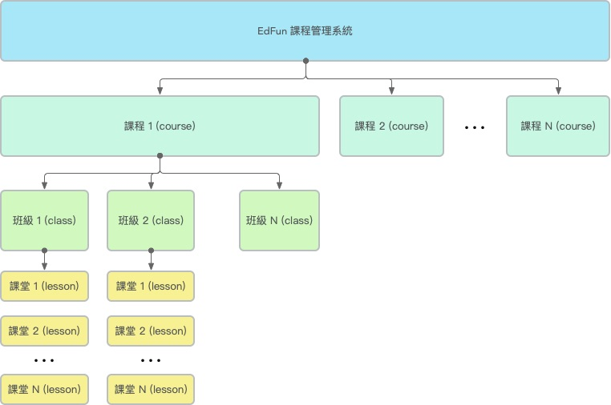

# 課程管理簡介
操作員通過EdFun課程管理系統能創建任何數量的「課程」(courses)，一個課程內可以建立任何數量的「班級」(classes)，每個班級可以建立任何數量的「課堂」(lessons)，其結構如下圖：

操作員所建立的課程、班級、課堂都會在EdFun前台網站自動顯示，供同學瀏覽及報名。

但以下情況課程將不會在前台網站顯示：

1. 課程下沒有班級及課堂；
2. 課程下的所有班級報名時間已過或未到；
