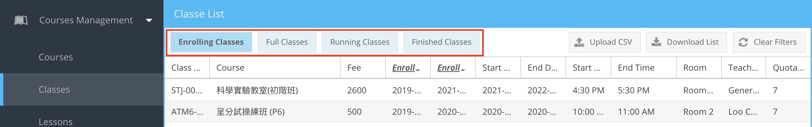
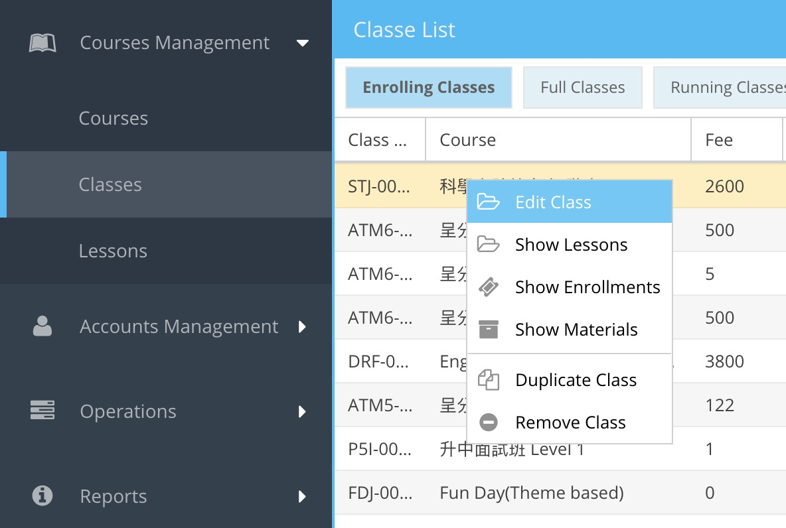
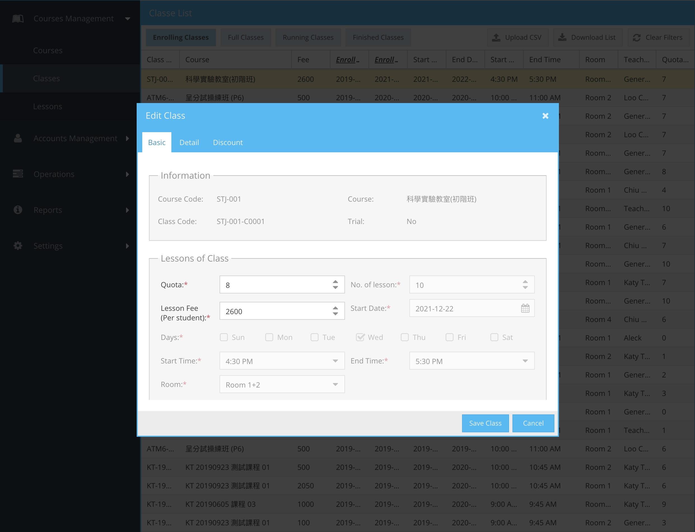
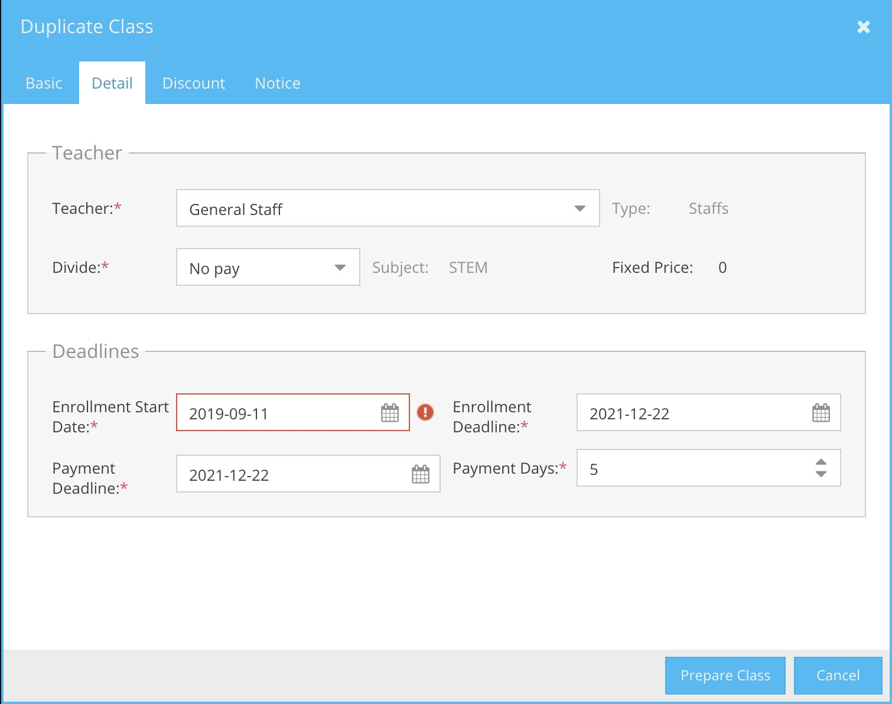
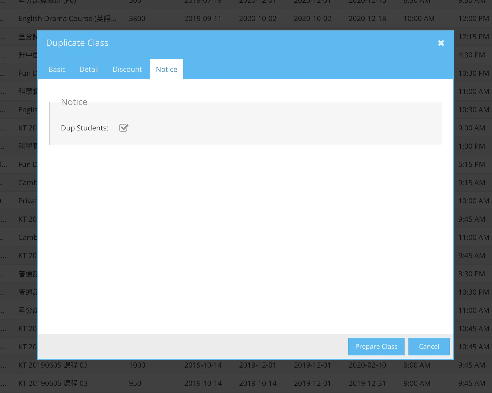

# 班級管理

- [班級管理](#%e7%8f%ad%e7%b4%9a%e7%ae%a1%e7%90%86)
  - [篩選捷徑](#%e7%af%a9%e9%81%b8%e6%8d%b7%e5%be%91)
  - [右鍵功能選單](#%e5%8f%b3%e9%8d%b5%e5%8a%9f%e8%83%bd%e9%81%b8%e5%96%ae)
      - [更新班級 (Edit Class)](#%e6%9b%b4%e6%96%b0%e7%8f%ad%e7%b4%9a-edit-class)
      - [複製班級 (Duplicate Class)](#%e8%a4%87%e8%a3%bd%e7%8f%ad%e7%b4%9a-duplicate-class)
      - [移除班級 (Remove Class)](#%e7%a7%bb%e9%99%a4%e7%8f%ad%e7%b4%9a-remove-class)

## 篩選捷徑
篩選捷徑位於工具列

| 功能               | 注解                   |
| ------------------ | ---------------------- |
| Enrolling Classes | 顯示正在進行報名的班級 |
| Full Classes      | 顯示已額滿的班級       |
| Running Classes   | 顯示正在進行的班級     |
| Finished Classes  | 顯示完成的班級         |

## 右鍵功能選單

| 功能             | 注解                                    |
| ---------------- | --------------------------------------- |
| Edit Class       | [更新此班級內容](#更新班級-edit-class)  |
| Show Lessons     | [打開班級所屬課堂](#)                   |
| Show Enrollments | [打開班級的報名記錄](#)                 |
| Show Meterials   | [打開課程教材](#)                       |
| Duplicate Class  | [複製此班級](#複製班級-duplicate-class) |
| Remove Class     | [移除此班級](#%e7%a7%bb%e9%99%a4%e7%8f%ad%e7%b4%9a-remove-class)                         |

#### 更新班級 (Edit Class)
操作方法可[參考此處](/courses-management/courses#建立班級-create-class)

**注意：**已建立的班級，部份欄位不能修改，會以灰色顯示。

#### 複製班級 (Duplicate Class)
操作員可以此功能複製一個班級。 
操作員必須更改開課日期(Start Date)及報名時間（Enrollment Date)，其他欄位何視乎需要修改。其他操作方法與[建立班級](/courses-management/courses#建立班級-create-class)相同。

系統預設，班級內的課堂及學員，會同時被複製到新的班級內。 
課堂內的學員會自勳收到新的繳費通知電郵。 

如果不想複製學員到新的班級，請把 Dup Students 的選項移除。

#### 移除班級 (Remove Class)
按右鍵選取 Remove Class，來移除班級。移除時，如果班級下還有課堂，班級將不能移除。操作員必須先移除所有班級下的課堂。