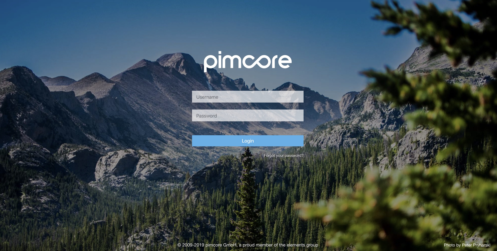
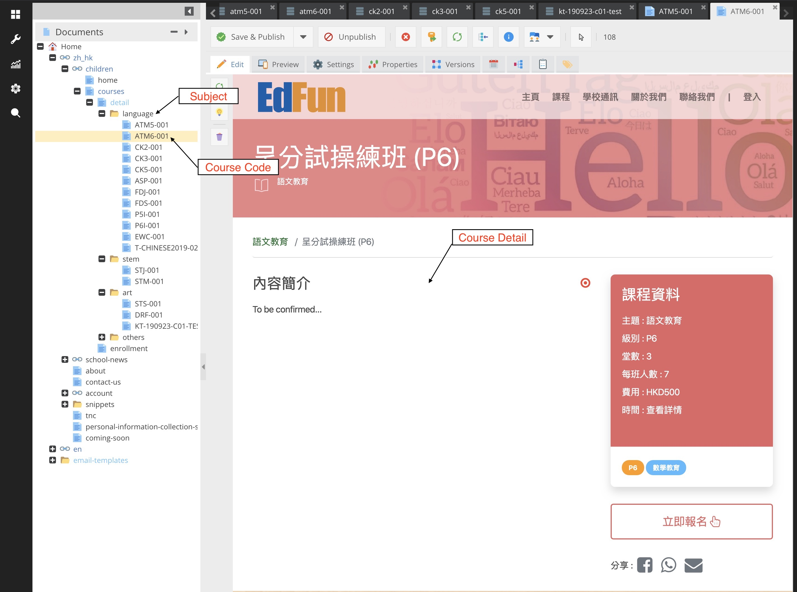
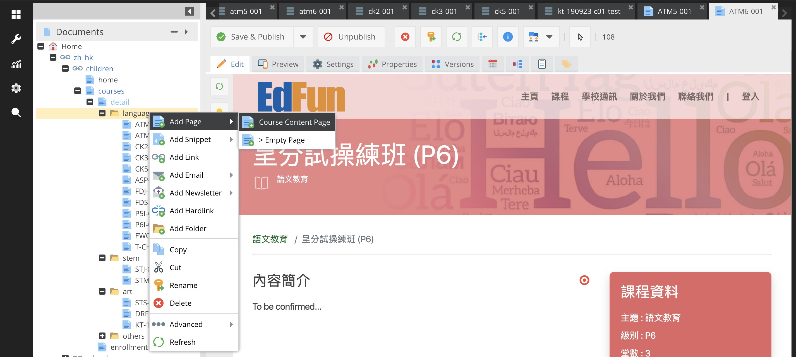
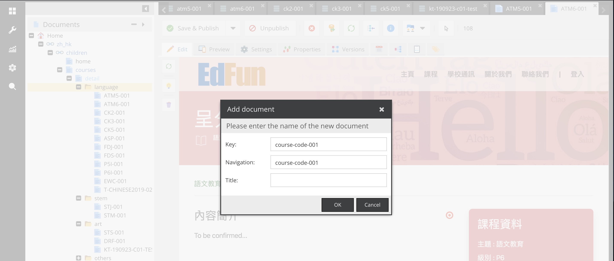
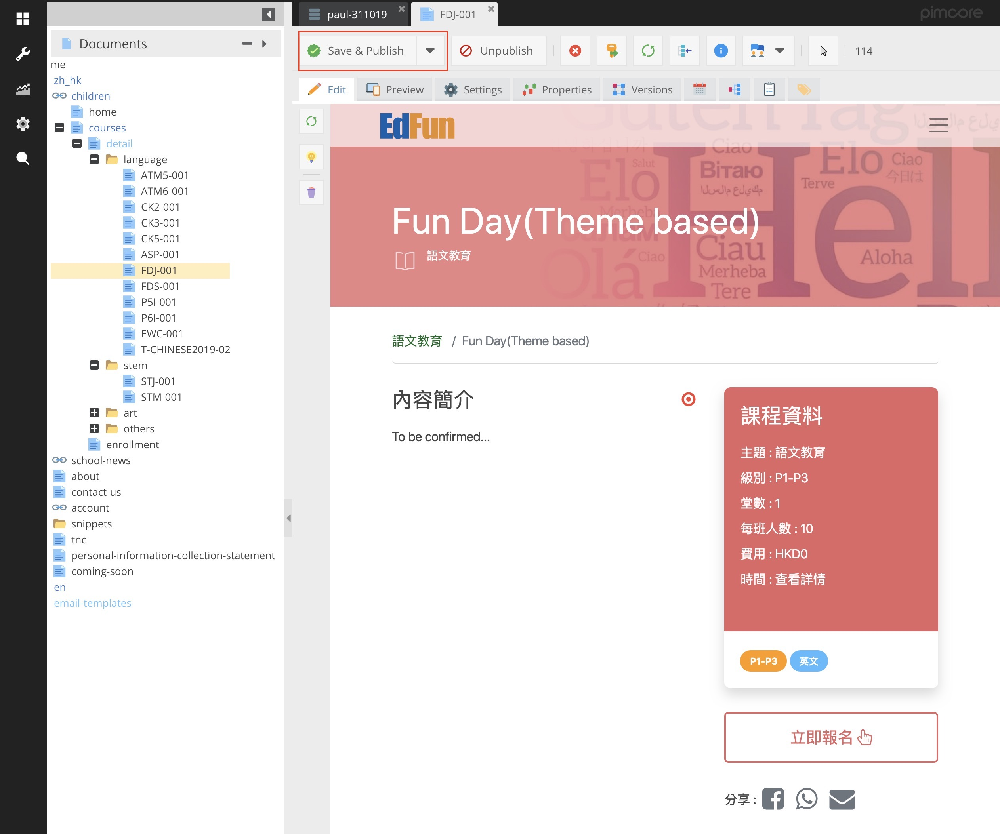
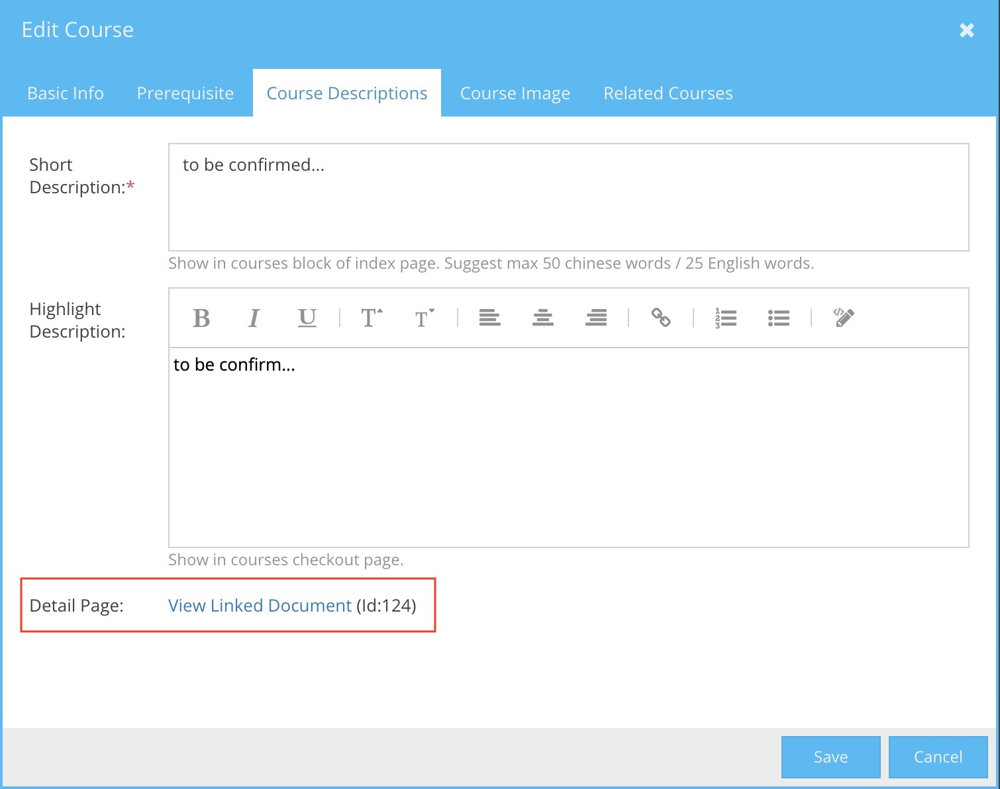

# 如何建立及連結課程介紹頁

每個課必須在CMS建立「課程介紹頁」，請在課程建立後到此建立對應的介紹頁。 
1. [請在此登入CMS](http://cpie.dq.hk/admin)。

2. 請在 Documents 找到 courses > detail > (subject) 文件夾。 
例如要建立「語文教育」的課程，便要找到 courses > detail > language 文件夾。

3. 在文件夾上按右鍵打開功能選單，選取 Course Content Page

4. 輸入 course code 到 Key 及 Navigation 欄位，按OK。

5. 輸入內容後按 Save & Publish。

6. 網頁便會自動與相同 course code 的課程連結。
