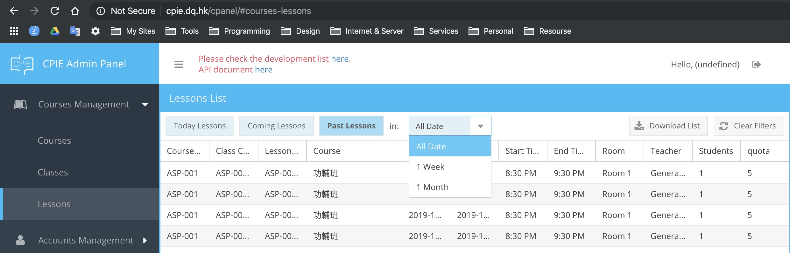
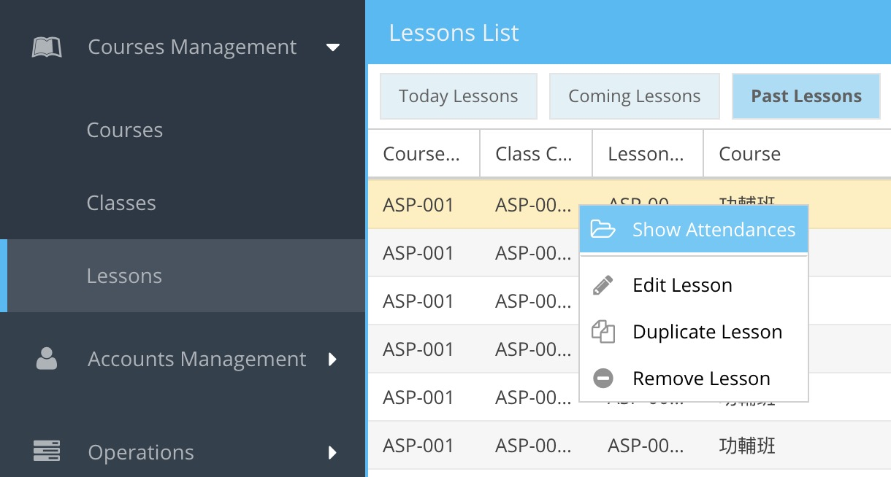
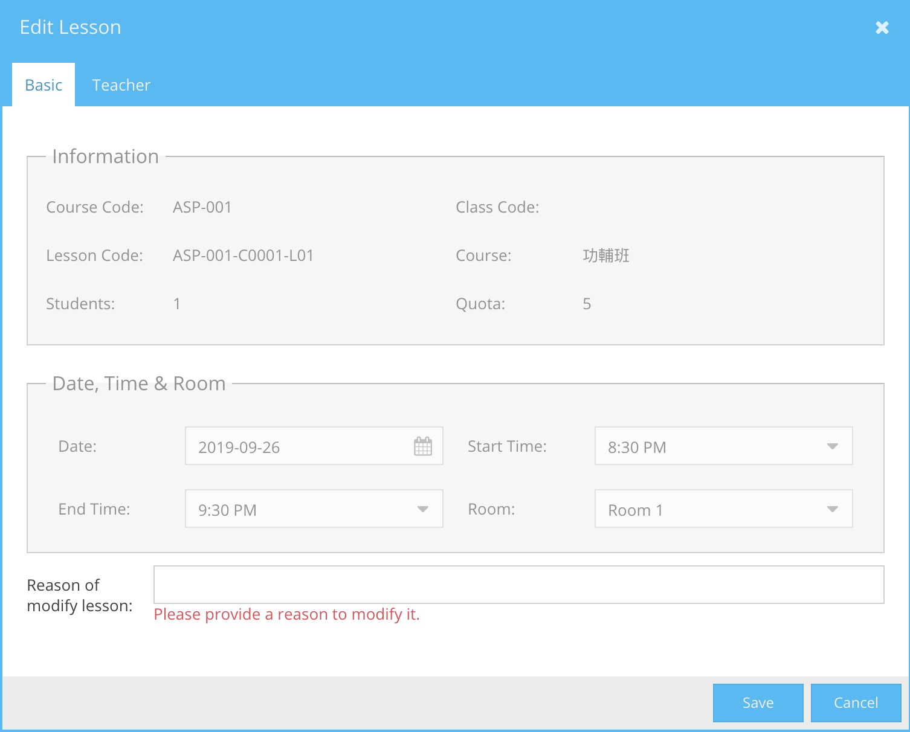
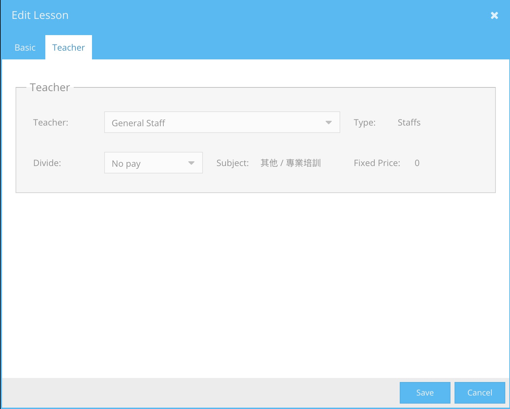
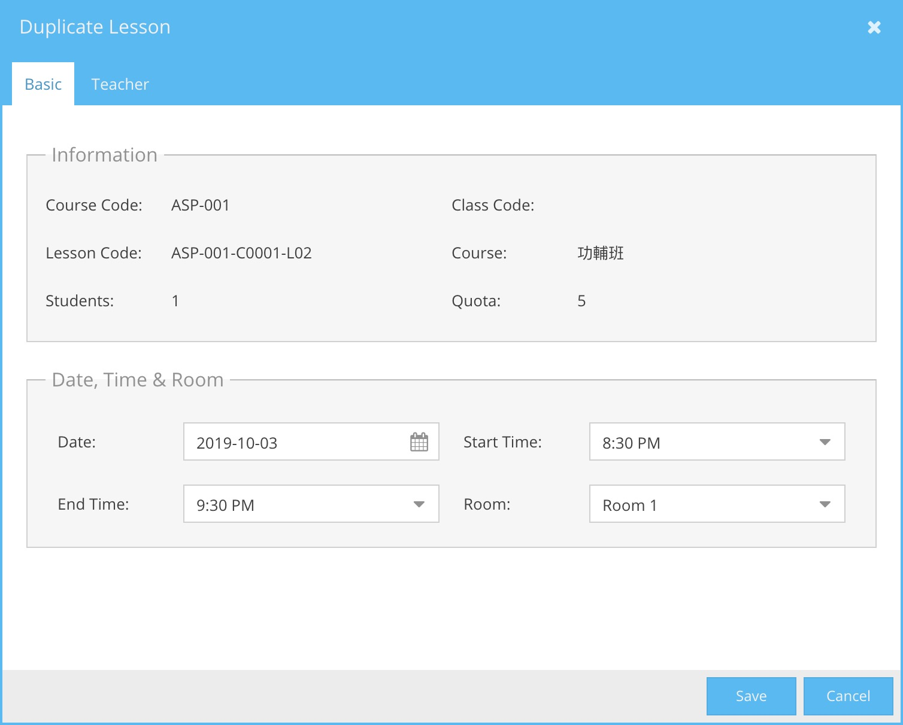

## 課堂管理

- [課堂管理](#%e8%aa%b2%e5%a0%82%e7%ae%a1%e7%90%86)
- [篩選捷徑](#%e7%af%a9%e9%81%b8%e6%8d%b7%e5%be%91)
- [右鍵功能選單](#%e5%8f%b3%e9%8d%b5%e5%8a%9f%e8%83%bd%e9%81%b8%e5%96%ae)
    - [學員記錄 (Show Attendances)](#%e5%ad%b8%e5%93%a1%e8%a8%98%e9%8c%84-show-attendances)
    - [更新課堂資料 (Edit Lesson)](#%e6%9b%b4%e6%96%b0%e8%aa%b2%e5%a0%82%e8%b3%87%e6%96%99-edit-lesson)
    - [複製課堂 (Duplicate Lesson)](#%e8%a4%87%e8%a3%bd%e8%aa%b2%e5%a0%82-duplicate-lesson)
    - [移除課堂 (Remove Class)](#%e7%a7%bb%e9%99%a4%e8%aa%b2%e5%a0%82-remove-class)

## 篩選捷徑
篩選捷徑位於工具列

| 功能           | 注解                 |
| -------------- | -------------------- |
| Today Lessons  | 顯示今日的課堂       |
| Coming Lessons | 顯示明日或以後的課堂 |
| Past Lessons   | 顯示過去的課堂       |

同時，操作員亦可顯示全部，一個星期或一個月的記錄

| 功能     | 注解           |
| -------- | -------------- |
| All Date | 所有課堂       |
| 1 Week   | 一星期內的課堂 |
| 1 Month  | 一個月內的課堂 |

## 右鍵功能選單

| 功能             | 注解                 |
| ---------------- | -------------------- |
| Show Attendances | 打開此課堂的學員記錄 |
| Edit Lesson      | 更新此課堂資料       |
| Duplicate Lesson | 複製此課堂到新的日期 |
| Remove Lesson    | 移除此課堂           |

#### 學員記錄 (Show Attendances)
打開此課堂的學員出席記錄頁。

#### 更新課堂資料 (Edit Lesson)
已建立的課堂，一般不應被修改。如要修改，操作員必須在 Reason of modify lesson 欄內填寫原因。填寫後，操作員便可更改內容。

**基本資料 (Basic)**

| 欄位 | 注解 | 備注 |
| --- | --- | --- |
| Date | 課堂日期 |	|
| Start Time | 課堂開始時間 | |
| End Time | 課堂結束時間 | |
| Room | 選用班房 |	|

**導師資料 (Teacher)**

| 欄位 | 注解 | 備注 |
| --- | --- | --- |
| Teacher | 導師 |
| Divide | 分成 |

關於導師與分成的設定，請看[管理導師](http://localhost:3000/#/accounts-management/teachers?id=main)。

#### 複製課堂 (Duplicate Lesson)
操作員可以此功能複製一個班級。 
操作員必須更改開課日期(Start Date)或時時間（Start Time)，其他欄位何視乎需要修改。按 Save 後，班級內便新增一個課堂。

#### 移除課堂 (Remove Class)
操作員可以此功能移除課堂。如果課堂的班級已有學員報名，課堂將不能移除。