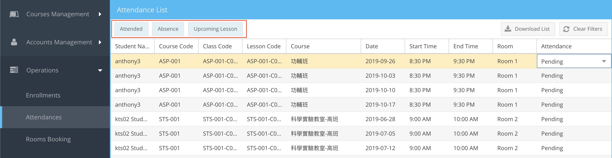
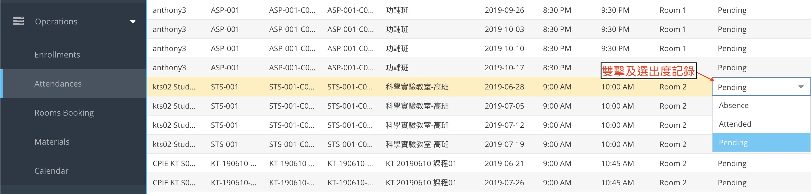

# 出席記錄

- [出席記錄](#%e5%87%ba%e5%b8%ad%e8%a8%98%e9%8c%84)
  - [篩選捷徑](#%e7%af%a9%e9%81%b8%e6%8d%b7%e5%be%91)
  - [更改出席記錄](#%e6%9b%b4%e6%94%b9%e5%87%ba%e5%b8%ad%e8%a8%98%e9%8c%84)

---
## 篩選捷徑
篩選捷徑位於工具列

| 功能            | 注解                               |
| --------------- | ---------------------------------- |
| Attended | 已出席學員 |
| Absence | 缺席學員 |
| Upcoming Lesson | 今日及之後的課堂的學員 |

## 更改出席記錄

