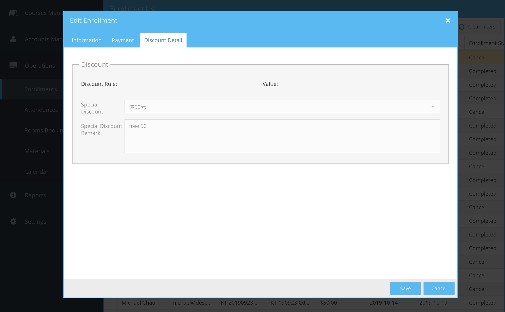

# 報名記錄

- [報名記錄](#%e5%a0%b1%e5%90%8d%e8%a8%98%e9%8c%84)
  - [篩選捷徑](#%e7%af%a9%e9%81%b8%e6%8d%b7%e5%be%91)
  - [右鍵功能選單](#%e5%8f%b3%e9%8d%b5%e5%8a%9f%e8%83%bd%e9%81%b8%e5%96%ae)
      - [更改報名記錄 (Edit Enrollment)](#%e6%9b%b4%e6%94%b9%e5%a0%b1%e5%90%8d%e8%a8%98%e9%8c%84-edit-enrollment)
      - [列印發票 (Print Invoice)](#%e5%88%97%e5%8d%b0%e7%99%bc%e7%a5%a8-print-invoice)
      - [轉班 (Change Class)](#%e8%bd%89%e7%8f%ad-change-class)
        - [轉班記錄](#%e8%bd%89%e7%8f%ad%e8%a8%98%e9%8c%84)
        - [轉班的費用差額處理](#%e8%bd%89%e7%8f%ad%e7%9a%84%e8%b2%bb%e7%94%a8%e5%b7%ae%e9%a1%8d%e8%99%95%e7%90%86)
      - [打開學員頁面 (View Student)](#%e6%89%93%e9%96%8b%e5%ad%b8%e5%93%a1%e9%a0%81%e9%9d%a2-view-student)
---
## 篩選捷徑
篩選捷徑位於工具列

| 功能            | 注解                               |
| --------------- | ---------------------------------- |
| Success Payment | 顯示已完成繳費的名單               |
| Pending Payment | 顯示已報名但未繳費的名單           |
| Waiting List    | 顯示候補名單                       |
| Failure Payment | 顯示已報名但在限時內沒有繳費的名單 |

同時，操作員亦可顯示全部，一個星期或一個月的記錄

| 功能     | 注解           |
| -------- | -------------- |
| All Date | 所有記錄       |
| 1 Week   | 一星期內的記錄 |
| 1 Month  | 一個月內的記錄 |

---
## 右鍵功能選單

| 功能            | 注解                 |
| --------------- | -------------------- |
| [Print Invoice](#%e5%88%97%e5%8d%b0%e7%99%bc%e7%a5%a8-print-invoice) | 列印發票（只會在 Payment Status: Paid 時出現）|
| [Edit Enrollment](#%e6%9b%b4%e6%94%b9%e5%a0%b1%e5%90%8d%e8%a8%98%e9%8c%84-edit-enrollment) | 更改此報名記錄       |
| [Change Class](#%e8%bd%89%e7%8f%ad-change-class) | 轉班（只會在 Enrollment Status: Completed 時出現）       |
| [View Student](#%e6%89%93%e9%96%8b%e5%ad%b8%e5%93%a1%e9%a0%81%e9%9d%a2-view-student)    | 打開始報名的學員記錄 |

#### 更改報名記錄 (Edit Enrollment)

**Information:** 
報名記錄內的基本資料不能更改

**Payment:** 
報名記錄內的 Enrollment Info 由系統自動管理，不能更改。

如果報名記錄的 Payment Status 是 Pending，操作員可更新 Payment Detail 的內容。 
如果報名記錄的 Payment Status 不是 Pending，操作員要管理人同意才能更改內容。

| 㯗位            | 注解     |
| --------------- | ------- |
| Payment Method | 付款方法 |
| Payment Status | |
| - Pending | 未付款：已報名，等待學員付款 |
| - Paid | 已付款：學員已付款，報名成功 |
| - Cancelled | 已取消：學員未有在限時內付款，此報名取消 |
| - Failed | 付款失敗：學員通過網上付款，但付款失敗 |
| Invoice Number | 發票編號：由系統自動產生，不能更改 |
| Center | 由那一問中心收費（由於現時只有一間中心，所以此功能未有作用）|
| Transaction Code | 交易代碼：如網上付款，此代碼由系統產生。如由操作員處理，輸入銀行交易編號 |
| Transaction Date | 交易日期：如網上付款，由系統自動產生。如由操作員處理，輸入銀行過數日期 |
| Bank Name | 銀行名稱：如網上付款，此欄留空。如由操作員處理，輸入過數銀行名稱 |
| Cheque Number | 如用支票付款，操作員輸入支票號碼 |
| Payment Remark | 操作員可輸入備註 |

**Discount:** 
如果報名記錄的 Payment Status 是 Pending，操作員可提供特別折扣給學員。

| 㯗位            | 注解     |
| --------------- | ------- |
| Spectal Discount | 選擇特別折扣 |
| Special Discount Remark | 注解特別折扣的原因 |

操作員按下 Change Payment Status 鍵，系統會要求管理人輸入密碼，能更改付款內容。

#### 列印發票 (Print Invoice)
如果學員已完成付款，操作員可右鍵選 Print Invoice 為學員列印發票。系統會產生一份發票的PDF文件，下載到操作員的PC上，操作員可打開PDF列印。

#### 轉班 (Change Class)
如果學員已完成付款後要求轉班，操作員可右鍵選 Change Class。系統會顯示 Search Class 介面，供操作員選新的班級，操作過程與[課程報名](/accounts-management/students?id=課程報名（new-enrollment）)相同。

##### 轉班記錄
轉班成功後，系統會顯示轉班記錄。

##### 轉班的費用差額處理
1. 如果轉堂後的費用**與之前相同**，系統會自動把新記錄的 Payment Status 設為 Paid，轉堂完成。
2. 如果轉堂後的費用**低於之前**，系統會自動把新記錄的 Payment Status 設為 Paid，轉堂完成，差額將不會處理。
3. 如果轉堂後的費用**高於之前**，系統會自動把新記錄的 Payment Status 設為 Pending，學員需繳交差價後，轉堂才算完成。如果學員沒有付款，Payment Status 會轉為 Cancelled，轉堂不能完成。

#### 打開學員頁面 (View Student)
操作員可右鍵選 View Student，以打開此報名記錄的學員。

