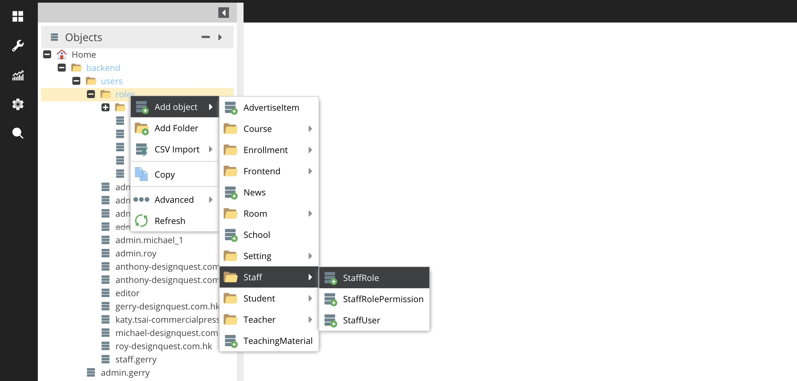
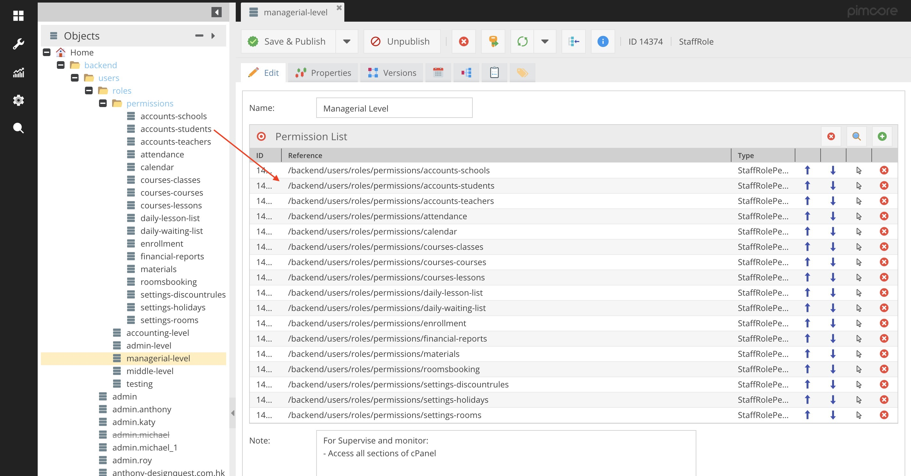
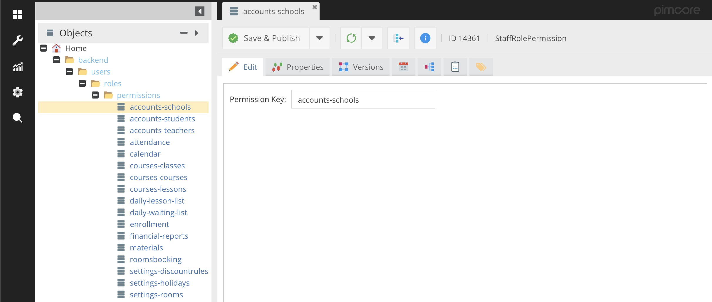
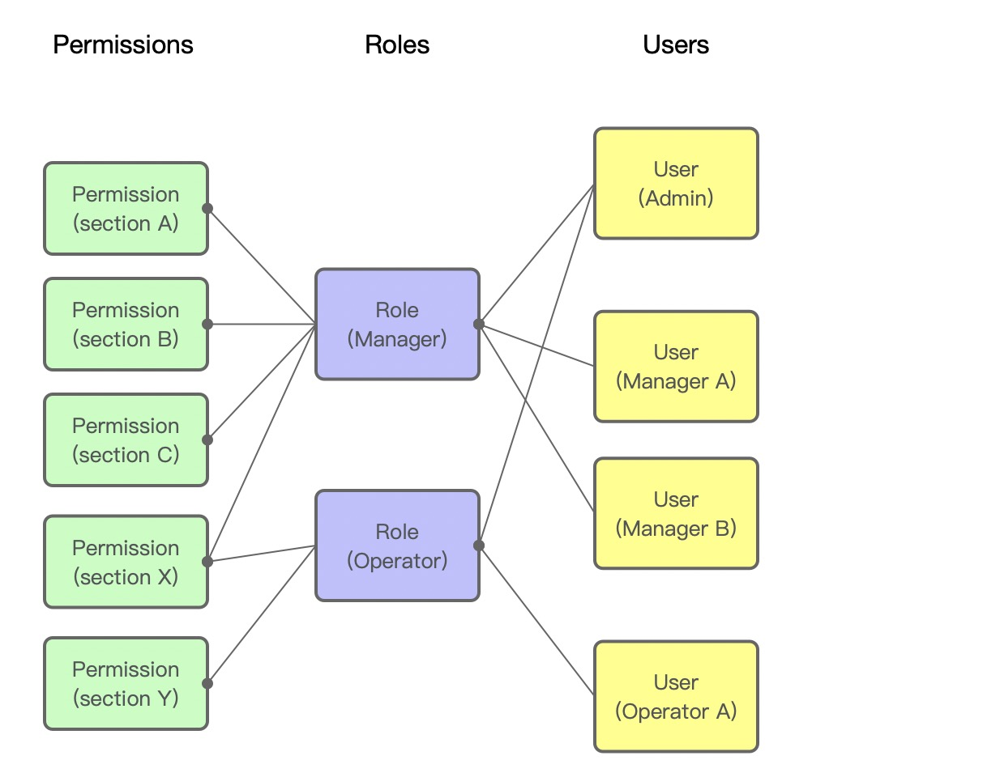

# 權限管理

### 新增/更改 cPanel 使用者權限

1. 在 Objects > Home > backend > users > roles 右鍵打開功能選單，選 Add object > Staff > StaffRole

2. 填寫所需資料：
   - Name：權限名稱
   - Notes：此權限的簡單使用描述

3. 在 Objects > Home > backend > users > roles > permissions 把所需的 permission 拉到 Permission List 欄內。這裡管理使用者能進入 cPanel 的那些頁面。

3. 完成後按 Save & Publish 

#### 關於 permissions
Permissions 是系統預設的且不能修改的。 

Permission Key 是指示此 permission 能進入 cPanel 的那一個頁面。 
當一個 permission 加入了一個 role，再把這個 role 指派給一個 cPanel user，此使用者就能進入 cPanel 的那一個頁面。

