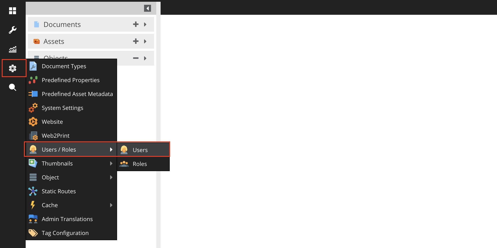
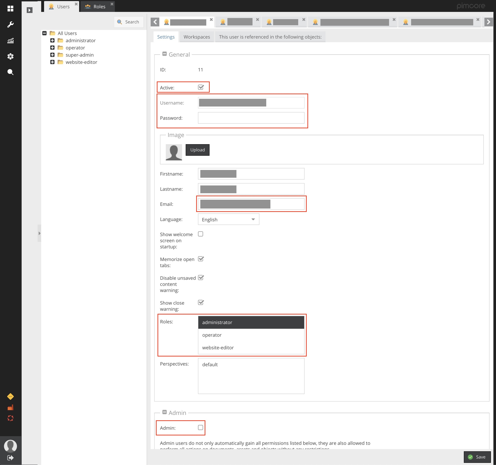
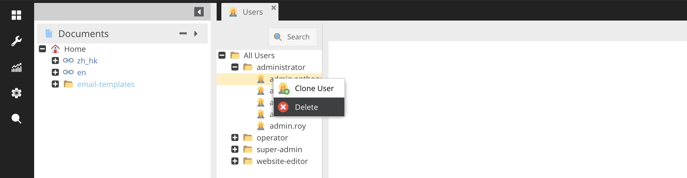
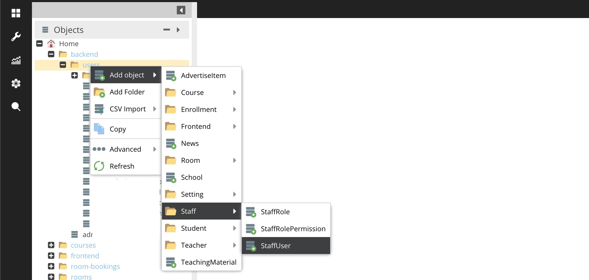
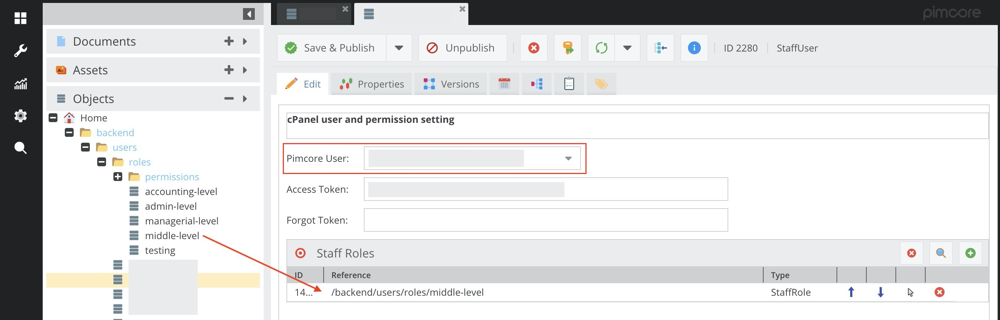
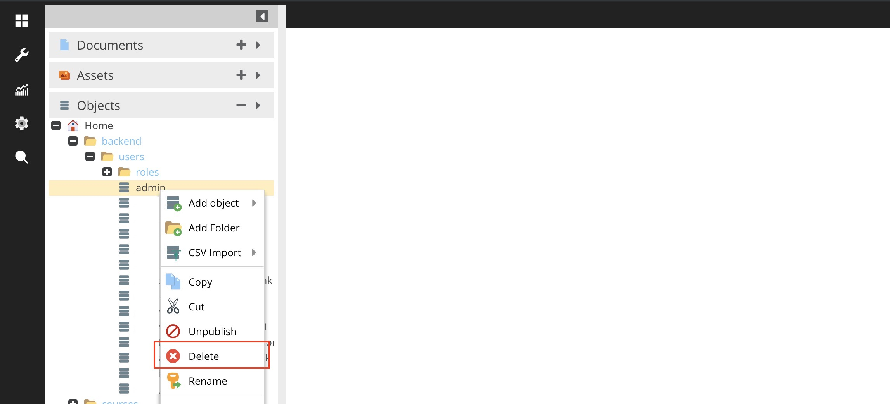

# 管理員/操作員管理

### 新增/更改 Pimcore 使用者

1. 在 Pimcore 打開 Users 頁面

2. 填寫使用者資料後按 Save: 
   - 勾選 Active，此戶口才能使用
   - Username & Password 會同時用於 Pimcore 及 cPanel 的登入
   - Email 在重設密碼時使用
   - Roles: 
     - 選 administrator，使用者可管理 Pimcore 系統內的所有內容
     - 選 operator，使用者不會在 Pimcore 系統內有任何操作權限
     - 選 website-editor，使用者可更改前台網站的內容
   - 勾選 Admin 則使用者可在 Pimcore 進行任何操作

### 移除 Pimcore User

1. 在 Pimcore 打開 Users 頁面

2. 在 User 選單中到 user，右鍵打開功能選單，選 Delete

### 新增/更改 cPanel 使用者

1. 確認已建立 Pimcore User
2. 在 Objects > Home > backend > users 右鍵打開功能選單，選 Add object > Staff > StaffUser

3. 選擇 Pimcore User。如未有 Pimcore User，請先[新增](#新增更改-pimcore-使用者) Pimcore user
4. 在 Objects > Home > backend > users > roles 把所需的 roles 拉到 Saff Roles 欄內

5. 完成後按 Save & Publish 

### 移除 cPpnel User
1. 在 Objects > Home > backend > users 找到 user，右鍵打開功能選單，選 Delete

> 注意：不要 Unpublish user，這樣會使 cPanel 的登入系統發生錯誤。
